# 药企进销存：ER 图与 UML

> 依据当前库 `pharma_ims` 与 Java 实体整理（B/S 已接入）。  
> 登录 / 菜单 / 角色仍用 `sys_*`，与业务表同库但模型独立，**不画进药企图**。  
> 旧仓管 `bus_*`（按 SKU 扣库存）与药企（按 **药品 + 仓库 + 批号 + 质量状态**）账粒度不同，**禁止混画**。

预览：VS Code Markdown 预览、Typora、GitHub、[mermaid.live](https://mermaid.live)。

---

## 目录

1. [业务总览](#1-业务总览)
2. [ER 图](#2-er-图)
   - [2.0 总览（只关系）](#20-总览只关系不堆字段)
   - [2.1 档案层](#21-档案层)
   - [2.2 进货层](#22-进货层)
   - [2.3 出库层](#23-出库层含红冲回款收货)
   - [2.4 库存与升益](#24-库存与升益)
   - [2.5 追溯层](#25-追溯层)
   - [2.6 日清 / 月结](#26-日清--月结)
   - [2.7 关系与约束](#27-关系与约束)
3. [UML](#3-uml)
   - [3.1 类图 · 档案](#31-类图--档案)
   - [3.2 类图 · 进销存单据](#32-类图--进销存单据)
   - [3.3 类图 · 库存 / 升益 / 追溯 / 结账](#33-类图--库存--升益--追溯--结账)
   - [3.4 用例图](#34-用例图)
   - [3.5 时序图](#35-时序图)
   - [3.6 状态图](#36-状态图)
4. [表清单](#4-表清单)
5. [附录 A · 数据库选型](#附录-a--数据库选型)
6. [附录 B · 画图工具](#附录-b--画图工具)

---

## 1. 业务总览

```text
档案层
  岗位 / 员工 / 供应商 / 客户 / 药品(含器械) / 仓库

单据层
  进货单 + 明细     确认后 → 批号库存增加
  出库单 + 明细     确认后 → 批号库存减少
                    主表含发票号；明细含 SPDID
                    可红冲 / 回款 / 发货签收
  升益单 + 明细     确认后 → 按实盘调整批号库存

库存与追溯
  批号库存：药品 + 仓库 + 批号 + 质量状态 = 一条
  追溯码：按明细 SPDID 挂多条码
  包装关联：大包装 → 中包装 → 最小包装

结账层（汇总快照，无物理外键）
  日清记录 / 月结记录
```

核心查询链（出库追溯）：

```text
发票号  sales_orders.invoice_no
    → 出库明细  sales_order_items.spdid
    → 追溯码    trace_codes.code
    → 包装树    trace_pack_relations（parent_code / child_code）
```

档案编号约定（演示数据）：

| 对象 | 主键区间 | 示例 |
|---|---|---|
| 客户 | `1xxxxx` | `100001` 南方医院 |
| 供应商 | `2xxxxx` | `200001` 广州医药 |
| 药品 | `3xxxxx` | `300001` 阿莫西林 |
| 器械 | `4xxxxx` | `400001` 一次性注射器 |

---

## 2. ER 图

约定：

- 图中实体名、字段名为中文，便于展示；物理表名见第 4 节。
- 多数关联是 **逻辑外键**（MyBatis-Plus 存 `*_id` / `spdid` / 码值），库中不一定建物理 FK。
- 图里只放业务主键、外键、唯一键和关键状态；完整列在各层表格。

### 2.0 总览（只关系，不堆字段）

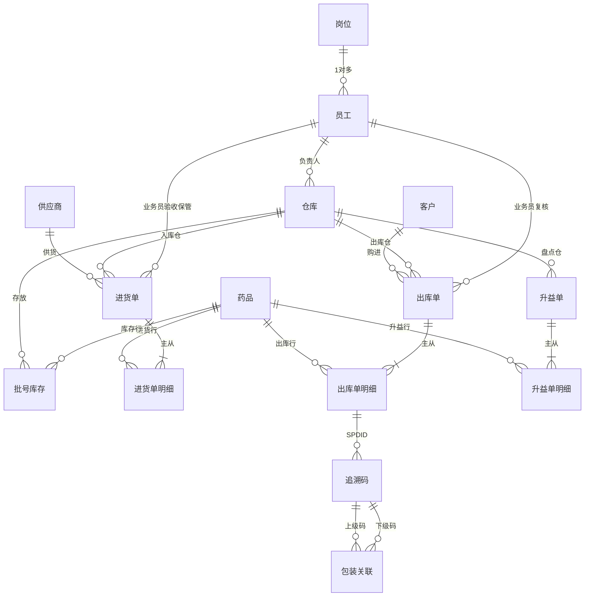
```mermaid
erDiagram
  岗位 ||--o{ 员工 : "1对多"
  员工 ||--o{ 仓库 : "负责人"
  供应商 ||--o{ 进货单 : "供货"
  客户 ||--o{ 出库单 : "购进"
  仓库 ||--o{ 进货单 : "入库仓"
  仓库 ||--o{ 出库单 : "出库仓"
  仓库 ||--o{ 批号库存 : "存放"
  仓库 ||--o{ 升益单 : "盘点仓"
  药品 ||--o{ 进货单明细 : "进货行"
  药品 ||--o{ 出库单明细 : "出库行"
  药品 ||--o{ 批号库存 : "库存行"
  药品 ||--o{ 升益单明细 : "升益行"
  员工 ||--o{ 进货单 : "业务员验收保管"
  员工 ||--o{ 出库单 : "业务员复核"
  进货单 ||--|{ 进货单明细 : "主从"
  出库单 ||--|{ 出库单明细 : "主从"
  升益单 ||--|{ 升益单明细 : "主从"
  出库单明细 ||--o{ 追溯码 : "SPDID"
  追溯码 ||--o{ 包装关联 : "上级码"
  包装关联 }o--|| 追溯码 : "下级码"
```

### 2.1 档案层

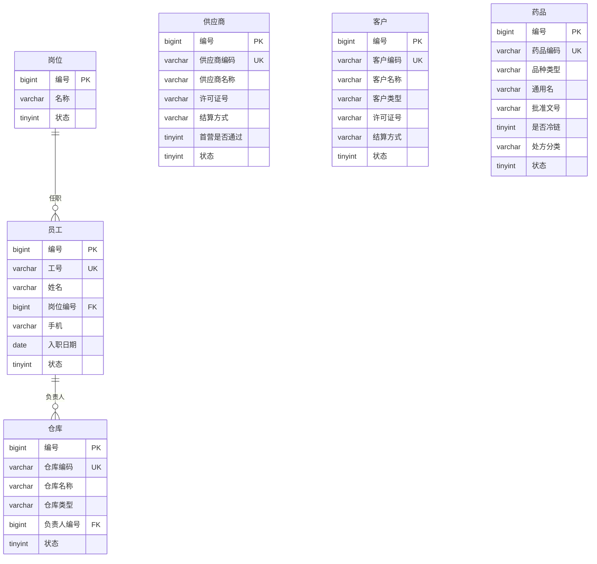
```mermaid
erDiagram
  岗位 ||--o{ 员工 : "任职"
  员工 ||--o{ 仓库 : "负责人"

  岗位 {
    bigint 编号 PK
    varchar 名称
    tinyint 状态
  }
  员工 {
    bigint 编号 PK
    varchar 工号 UK
    varchar 姓名
    bigint 岗位编号 FK
    varchar 手机
    date 入职日期
    tinyint 状态
  }
  供应商 {
    bigint 编号 PK
    varchar 供应商编码 UK
    varchar 供应商名称
    varchar 许可证号
    varchar 结算方式
    tinyint 首营是否通过
    tinyint 状态
  }
  客户 {
    bigint 编号 PK
    varchar 客户编码 UK
    varchar 客户名称
    varchar 客户类型
    varchar 许可证号
    varchar 结算方式
    tinyint 状态
  }
  药品 {
    bigint 编号 PK
    varchar 药品编码 UK
    varchar 品种类型
    varchar 通用名
    varchar 批准文号
    tinyint 是否冷链
    varchar 处方分类
    tinyint 状态
  }
  仓库 {
    bigint 编号 PK
    varchar 仓库编码 UK
    varchar 仓库名称
    varchar 仓库类型
    bigint 负责人编号 FK
    tinyint 状态
  }
```

| 中文名 | 表 | 关键列（物理名） | 说明 |
|---|---|---|---|
| 岗位 | `positions` | `id`, `name`, `status` | 库中有表；本仓库未建独立 Java Entity |
| 员工 | `employees` | `id`, `emp_no`, `name`, `position_id`, `mobile`, `hire_date`, `status` | 单据上的业务员 / 验收 / 保管 / 复核、仓库负责人引用此表 |
| 供应商 | `suppliers` | `id`(INPUT), `code`, `name`, `license_no`, `settle_type`, `first_camp_ok`, `status` | 首营未过仍可建档，确认入库时业务上应拦截 |
| 客户 | `customers` | `id`(INPUT), `code`, `name`, `customer_type`, `license_no`, `settle_type`, `status` | `customer_type`：医院 / 药店 / 诊所 |
| 药品 | `drugs` | `id`(INPUT), `code`, `category`, `generic_name`, `trade_name`, `spec`, `dosage_form`, `unit`, `manufacturer`, `approval_no`, `barcode`, `is_cold_chain`, `rx_type`, `ref_purchase_price`, `ref_sale_price`, `status` | `category`：药品 / 器械 |
| 仓库 | `warehouses` | `id`, `code`, `name`, `wh_type`, `address`, `manager_id`, `status` | `wh_type`：合格 / 待验 / 退货 / 不合格 |

制单人 / 确认人 / 日清人用的是 `sys_user.id`，不是 `employees.id`。

### 2.2 进货层

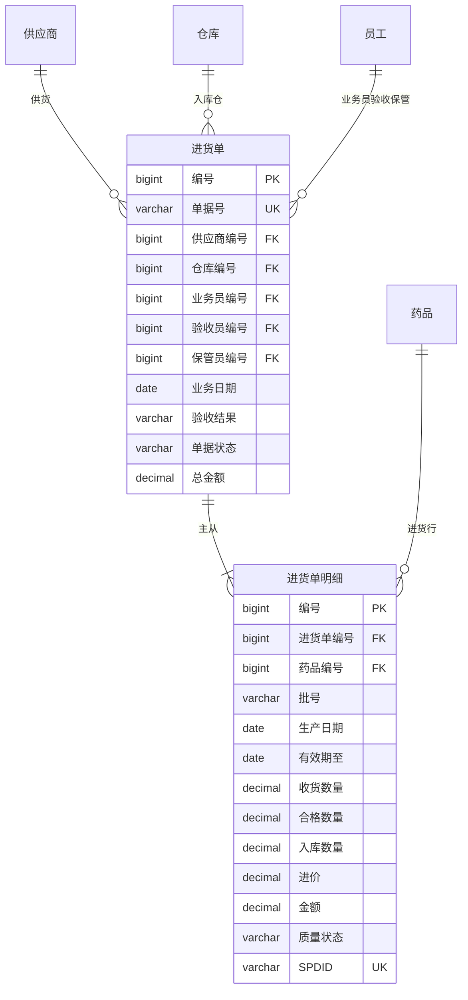
```mermaid
erDiagram
  供应商 ||--o{ 进货单 : "供货"
  仓库 ||--o{ 进货单 : "入库仓"
  员工 ||--o{ 进货单 : "业务员验收保管"
  进货单 ||--|{ 进货单明细 : "主从"
  药品 ||--o{ 进货单明细 : "进货行"

  进货单 {
    bigint 编号 PK
    varchar 单据号 UK
    bigint 供应商编号 FK
    bigint 仓库编号 FK
    bigint 业务员编号 FK
    bigint 验收员编号 FK
    bigint 保管员编号 FK
    date 业务日期
    varchar 验收结果
    varchar 单据状态
    decimal 总金额
  }
  进货单明细 {
    bigint 编号 PK
    bigint 进货单编号 FK
    bigint 药品编号 FK
    varchar 批号
    date 生产日期
    date 有效期至
    decimal 收货数量
    decimal 合格数量
    decimal 入库数量
    decimal 进价
    decimal 金额
    varchar 质量状态
    varchar SPDID UK
  }
```

| 中文名 | 表 | 关键列 | 说明 |
|---|---|---|---|
| 进货单 | `purchase_orders` | `order_no`, `supplier_id`, `warehouse_id`, `salesman_id`, `checker_id`, `keeper_id`, `biz_date`, `check_result`, `status`, `total_amount`, `created_by`, `confirmed_by`, `confirmed_at` | `status`：草稿 / 已确认 / 已过账（已过账预留） |
| 进货明细 | `purchase_order_items` | `order_id`, `drug_id`, `batch_no`, `production_date`, `expire_date`, `receive_qty`, `qualified_qty`, `stock_in_qty`, `purchase_price`, `amount`, `quality_status`, `spdid` | 确认入库按 `stock_in_qty` 增加批号库存 |

### 2.3 出库层（含红冲、回款、收货）

出库主表承担四类语义，仍是一张 `sales_orders`，用字段区分，不拆表：

| 字段 | 取值 | 作用 |
|---|---|---|
| `order_type` | 正常 / 红冲 | 红冲确认后 **加回** 批号库存 |
| `original_invoice_no` | 20 位蓝字发票号 | 红冲单指向原出库单 |
| `paid_status` | 未回款 / 部分回款 / 已回款 | 员工端按发票查询、未回款列表 |
| `receive_status` | 待收货 / 已签收 / 部分签收 / 拒收 | 医院收货确认；红冲单不走收货 |

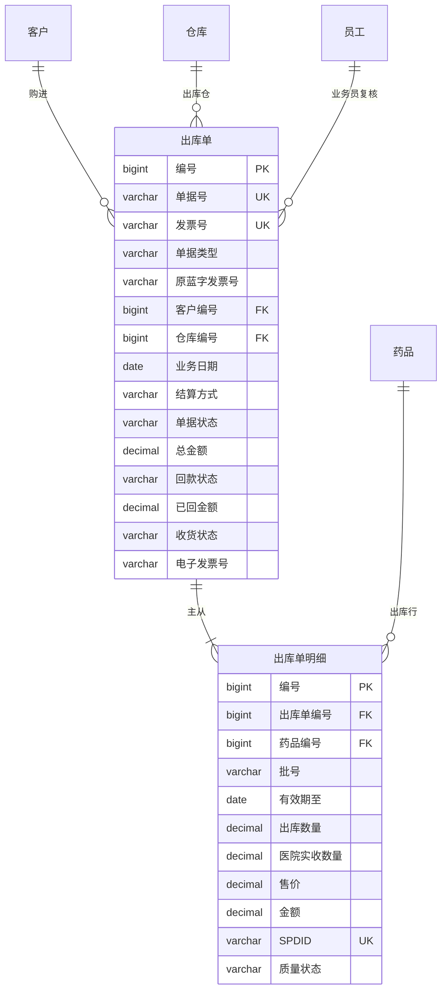
```mermaid
erDiagram
  客户 ||--o{ 出库单 : "购进"
  仓库 ||--o{ 出库单 : "出库仓"
  员工 ||--o{ 出库单 : "业务员复核"
  出库单 ||--|{ 出库单明细 : "主从"
  药品 ||--o{ 出库单明细 : "出库行"

  出库单 {
    bigint 编号 PK
    varchar 单据号 UK
    varchar 发票号 UK
    varchar 单据类型
    varchar 原蓝字发票号
    bigint 客户编号 FK
    bigint 仓库编号 FK
    date 业务日期
    varchar 结算方式
    varchar 单据状态
    decimal 总金额
    varchar 回款状态
    decimal 已回金额
    varchar 收货状态
    varchar 电子发票号
  }
  出库单明细 {
    bigint 编号 PK
    bigint 出库单编号 FK
    bigint 药品编号 FK
    varchar 批号
    date 有效期至
    decimal 出库数量
    decimal 医院实收数量
    decimal 售价
    decimal 金额
    varchar SPDID UK
    varchar 质量状态
  }
```

| 中文名 | 表 | 其余列 | 说明 |
|---|---|---|---|
| 出库单 | `sales_orders` | `salesman_id`, `reviewer_id`, `paid_at`, `ship_time`, `einvoice_path`, `received_at`, `received_by`, `receive_remark`, `created_by`, `confirmed_by`, `confirmed_at` | 发票号 20 位：业务日期 8 位 + `0001` + 8 位流水 |
| 出库明细 | `sales_order_items` | `expire_date`, `received_qty`, `receive_remark` | 签收后回写实收数量 |

红冲是 **另一张出库单**（`order_type=红冲`），不是改原单。确认后按明细数量加回对应批号库存。

### 2.4 库存与升益

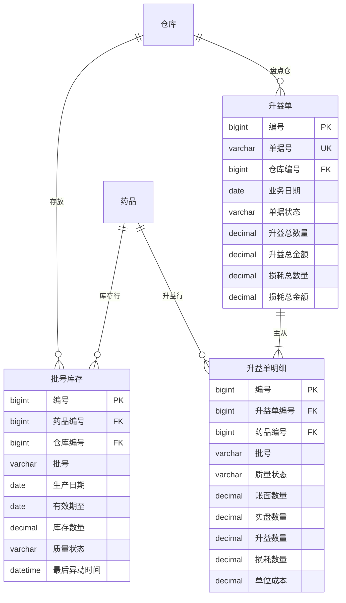
```mermaid
erDiagram
  药品 ||--o{ 批号库存 : "库存行"
  仓库 ||--o{ 批号库存 : "存放"
  仓库 ||--o{ 升益单 : "盘点仓"
  升益单 ||--|{ 升益单明细 : "主从"
  药品 ||--o{ 升益单明细 : "升益行"

  批号库存 {
    bigint 编号 PK
    bigint 药品编号 FK
    bigint 仓库编号 FK
    varchar 批号
    date 生产日期
    date 有效期至
    decimal 库存数量
    varchar 质量状态
    datetime 最后异动时间
  }
  升益单 {
    bigint 编号 PK
    varchar 单据号 UK
    bigint 仓库编号 FK
    date 业务日期
    varchar 单据状态
    decimal 升益总数量
    decimal 升益总金额
    decimal 损耗总数量
    decimal 损耗总金额
  }
  升益单明细 {
    bigint 编号 PK
    bigint 升益单编号 FK
    bigint 药品编号 FK
    varchar 批号
    varchar 质量状态
    decimal 账面数量
    decimal 实盘数量
    decimal 升益数量
    decimal 损耗数量
    decimal 单位成本
  }
```

**库存唯一性（重要）**

```text
uk_batch_stocks (drug_id, warehouse_id, batch_no, quality_status)
```

一物一批一库一质量状态 = 一条库存。进货确认增加、出库确认减少、红冲确认加回、升益确认按 `actual_qty - book_qty` 调整。

### 2.5 追溯层

物理上 `trace_codes` **没有** 指向明细表的外键，靠 `spdid` 对齐；入库明细、出库明细都可以挂码。包装树存在 `trace_pack_relations`，用码值自关联，模拟码上放心大小码解析。

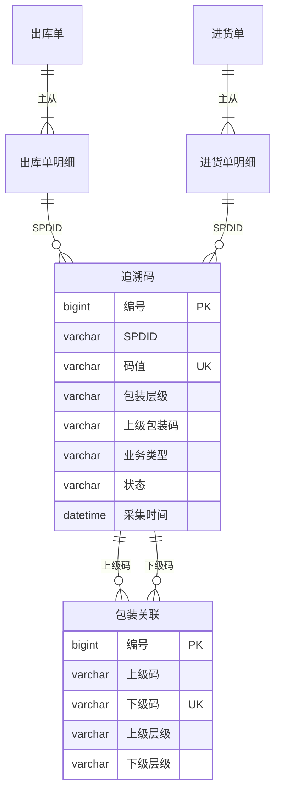
```mermaid
erDiagram
  出库单 ||--|{ 出库单明细 : "主从"
  进货单 ||--|{ 进货单明细 : "主从"
  出库单明细 ||--o{ 追溯码 : "SPDID"
  进货单明细 ||--o{ 追溯码 : "SPDID"
  追溯码 ||--o{ 包装关联 : "上级码"
  包装关联 }o--|| 追溯码 : "下级码"

  追溯码 {
    bigint 编号 PK
    varchar SPDID
    varchar 码值 UK
    varchar 包装层级
    varchar 上级包装码
    varchar 业务类型
    varchar 状态
    datetime 采集时间
  }
  包装关联 {
    bigint 编号 PK
    varchar 上级码
    varchar 下级码 UK
    varchar 上级层级
    varchar 下级层级
  }
```

| 中文名 | 表 | 取值 | 说明 |
|---|---|---|---|
| 追溯码 | `trace_codes` | `pack_level`：大包装 / 中包装 / 最小包装；`biz_type`：入库 / 出库；`status`：正常 / 作废 | `parent_code` 指向上一级码 |
| 包装关联 | `trace_pack_relations` | 一个下级码只能有一个上级（`uk_trace_pack_child`） | 演示：1 箱 = 2 中包 = 6 小盒 |

采集接口：`POST /trace/addCodes`；解析：`POST /trace/parseCodes`（可先 `previewParse`）。

### 2.6 日清 / 月结

这两张表是 **按日 / 按月的汇总快照**，不引用具体单据 id，避免结账后单据变更把快照拖垮。图上不画虚线外键。

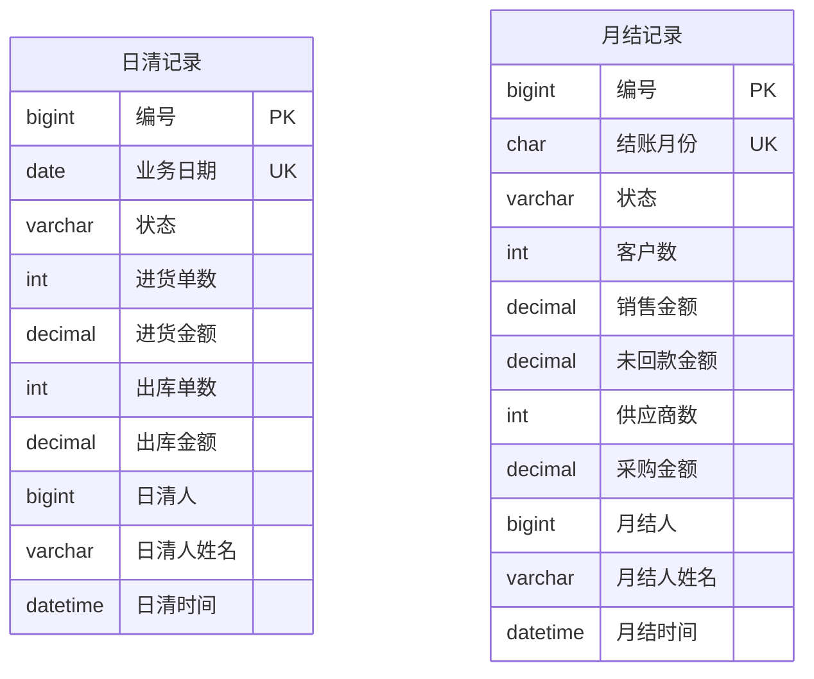
```mermaid
erDiagram
  日清记录 {
    bigint 编号 PK
    date 业务日期 UK
    varchar 状态
    int 进货单数
    decimal 进货金额
    int 出库单数
    decimal 出库金额
    bigint 日清人
    varchar 日清人姓名
    datetime 日清时间
  }
  月结记录 {
    bigint 编号 PK
    char 结账月份 UK
    varchar 状态
    int 客户数
    decimal 销售金额
    decimal 未回款金额
    int 供应商数
    decimal 采购金额
    bigint 月结人
    varchar 月结人姓名
    datetime 月结时间
  }
```

| 表 | 唯一键 | 默认状态 | 接口 |
|---|---|---|---|
| `daily_close_records` | `biz_date` | 已日清 | `/dailyClose/loadChecklist`、`/dailyClose/confirm` |
| `monthly_close_records` | `close_month`（`yyyy-MM`） | 已月结 | `/monthlyClose/loadStatement`、`/monthlyClose/confirm` |

进货统计 / 出货统计读已确认单据聚合，**不另建表**（`/pharmaStats`）。

### 2.7 关系与约束

| 关系 | 基数 | 关联键 | 说明 |
|---|---|---|---|
| 岗位 → 员工 | 1:N | `position_id` | |
| 员工 → 仓库 | 1:N | `manager_id` | 一名负责人可管多仓 |
| 供应商 → 进货单 | 1:N | `supplier_id` | 一单一个供应商 |
| 客户 → 出库单 | 1:N | `customer_id` | 一单一个客户 |
| 仓库 → 进货 / 出库 / 升益 / 库存 | 1:N | `warehouse_id` | |
| 进货单 → 明细 | 1:N | `order_id` | 至少一行才能确认 |
| 出库单 → 明细 | 1:N | `order_id` | 明细含 SPDID |
| 升益单 → 明细 | 1:N | `order_id` | |
| 药品 / 仓库 → 批号库存 | N:M | 库存表 | 唯一键见 2.4 |
| 出库明细 → 追溯码 | 1:N（逻辑） | `spdid` | 入库明细同样可挂 |
| 追溯码 → 包装关联 | 1:N / N:1 | `parent_code` / `child_code` | 下级码唯一 |
| 红冲单 → 原出库单 | N:1（逻辑） | `original_invoice_no` = `invoice_no` | 不改原单 |
| 日清 / 月结 | — | 无 FK | 日期 / 月份汇总 |

---

## 3. UML

类名、属性名与后端实体一致。`exist = false` 的展示字段（如 `drugName`）不进入类图。

### 3.1 类图 · 档案

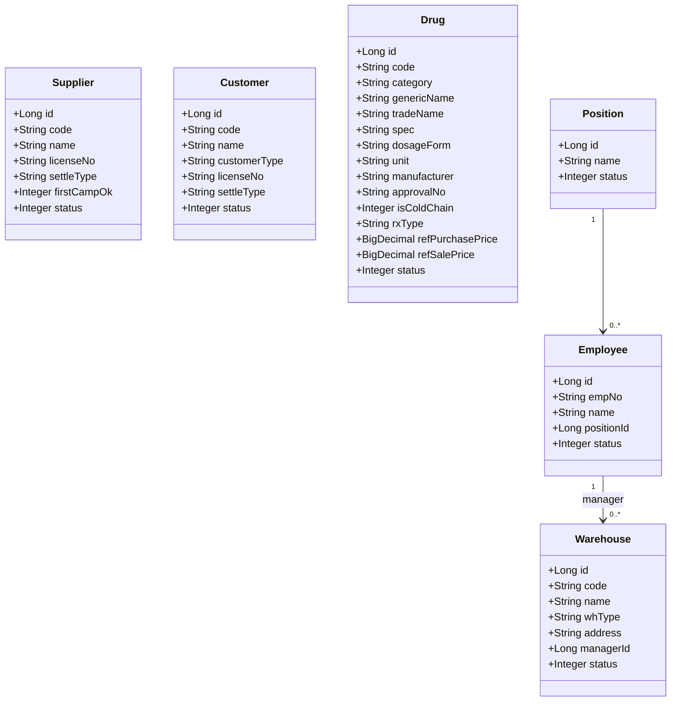
```mermaid
classDiagram
  class Supplier {
    +Long id
    +String code
    +String name
    +String licenseNo
    +String settleType
    +Integer firstCampOk
    +Integer status
  }
  class Customer {
    +Long id
    +String code
    +String name
    +String customerType
    +String licenseNo
    +String settleType
    +Integer status
  }
  class Drug {
    +Long id
    +String code
    +String category
    +String genericName
    +String tradeName
    +String spec
    +String dosageForm
    +String unit
    +String manufacturer
    +String approvalNo
    +Integer isColdChain
    +String rxType
    +BigDecimal refPurchasePrice
    +BigDecimal refSalePrice
    +Integer status
  }
  class Warehouse {
    +Long id
    +String code
    +String name
    +String whType
    +String address
    +Long managerId
    +Integer status
  }
  class Employee {
    +Long id
    +String empNo
    +String name
    +Long positionId
    +Integer status
  }
  class Position {
    +Long id
    +String name
    +Integer status
  }

  Position "1" --> "0..*" Employee
  Employee "1" --> "0..*" Warehouse : manager
```

`Position` / `Employee` 有表、无独立 Entity；类图补上便于和单据上的 `*Id` 对齐。

### 3.2 类图 · 进销存单据

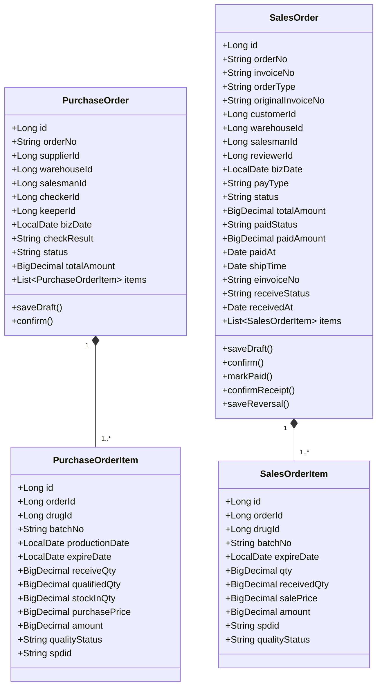
```mermaid
classDiagram
  class PurchaseOrder {
    +Long id
    +String orderNo
    +Long supplierId
    +Long warehouseId
    +Long salesmanId
    +Long checkerId
    +Long keeperId
    +LocalDate bizDate
    +String checkResult
    +String status
    +BigDecimal totalAmount
    +List~PurchaseOrderItem~ items
    +saveDraft()
    +confirm()
  }
  class PurchaseOrderItem {
    +Long id
    +Long orderId
    +Long drugId
    +String batchNo
    +LocalDate productionDate
    +LocalDate expireDate
    +BigDecimal receiveQty
    +BigDecimal qualifiedQty
    +BigDecimal stockInQty
    +BigDecimal purchasePrice
    +BigDecimal amount
    +String qualityStatus
    +String spdid
  }
  class SalesOrder {
    +Long id
    +String orderNo
    +String invoiceNo
    +String orderType
    +String originalInvoiceNo
    +Long customerId
    +Long warehouseId
    +Long salesmanId
    +Long reviewerId
    +LocalDate bizDate
    +String payType
    +String status
    +BigDecimal totalAmount
    +String paidStatus
    +BigDecimal paidAmount
    +Date paidAt
    +Date shipTime
    +String einvoiceNo
    +String receiveStatus
    +Date receivedAt
    +List~SalesOrderItem~ items
    +saveDraft()
    +confirm()
    +markPaid()
    +confirmReceipt()
    +saveReversal()
  }
  class SalesOrderItem {
    +Long id
    +Long orderId
    +Long drugId
    +String batchNo
    +LocalDate expireDate
    +BigDecimal qty
    +BigDecimal receivedQty
    +BigDecimal salePrice
    +BigDecimal amount
    +String spdid
    +String qualityStatus
  }

  PurchaseOrder "1" *-- "1..*" PurchaseOrderItem
  SalesOrder "1" *-- "1..*" SalesOrderItem
```

### 3.3 类图 · 库存 / 升益 / 追溯 / 结账

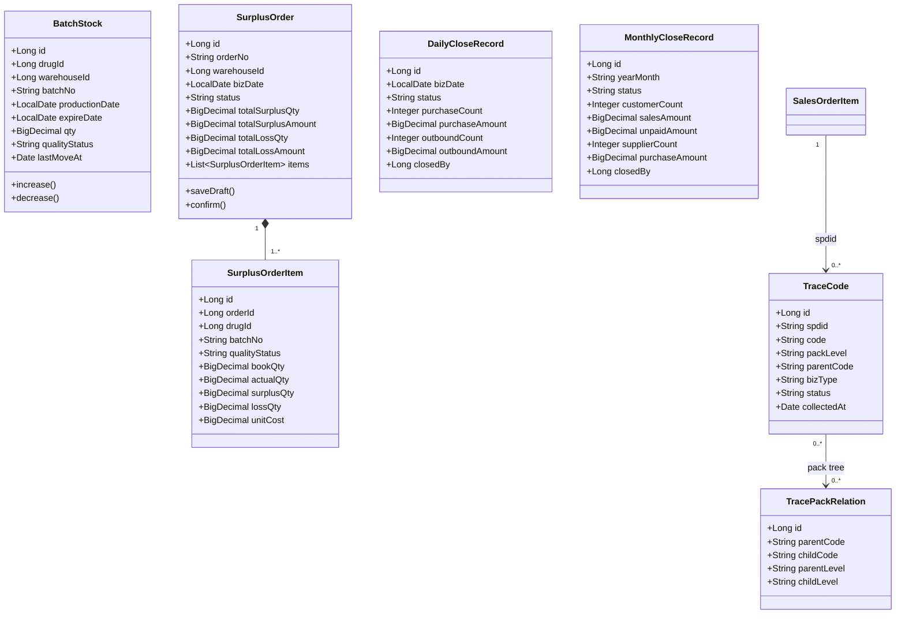
```mermaid
classDiagram
  class BatchStock {
    +Long id
    +Long drugId
    +Long warehouseId
    +String batchNo
    +LocalDate productionDate
    +LocalDate expireDate
    +BigDecimal qty
    +String qualityStatus
    +Date lastMoveAt
    +increase()
    +decrease()
  }
  class SurplusOrder {
    +Long id
    +String orderNo
    +Long warehouseId
    +LocalDate bizDate
    +String status
    +BigDecimal totalSurplusQty
    +BigDecimal totalSurplusAmount
    +BigDecimal totalLossQty
    +BigDecimal totalLossAmount
    +List~SurplusOrderItem~ items
    +saveDraft()
    +confirm()
  }
  class SurplusOrderItem {
    +Long id
    +Long orderId
    +Long drugId
    +String batchNo
    +String qualityStatus
    +BigDecimal bookQty
    +BigDecimal actualQty
    +BigDecimal surplusQty
    +BigDecimal lossQty
    +BigDecimal unitCost
  }
  class TraceCode {
    +Long id
    +String spdid
    +String code
    +String packLevel
    +String parentCode
    +String bizType
    +String status
    +Date collectedAt
  }
  class TracePackRelation {
    +Long id
    +String parentCode
    +String childCode
    +String parentLevel
    +String childLevel
  }
  class DailyCloseRecord {
    +Long id
    +LocalDate bizDate
    +String status
    +Integer purchaseCount
    +BigDecimal purchaseAmount
    +Integer outboundCount
    +BigDecimal outboundAmount
    +Long closedBy
  }
  class MonthlyCloseRecord {
    +Long id
    +String yearMonth
    +String status
    +Integer customerCount
    +BigDecimal salesAmount
    +BigDecimal unpaidAmount
    +Integer supplierCount
    +BigDecimal purchaseAmount
    +Long closedBy
  }

  SurplusOrder "1" *-- "1..*" SurplusOrderItem
  SalesOrderItem "1" --> "0..*" TraceCode : spdid
  TraceCode "0..*" --> "0..*" TracePackRelation : pack tree
```

### 3.4 用例图

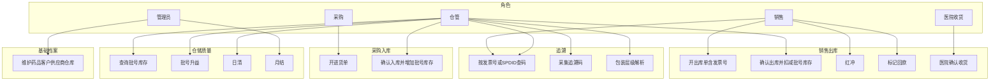
```mermaid
flowchart TB
  subgraph actors [角色]
    Admin[管理员]
    Keeper[仓管]
    Buyer[采购]
    Sales[销售]
    Hospital[医院收货]
  end

  subgraph master [基础档案]
    UC1[维护药品客户供应商仓库]
  end

  subgraph in [采购入库]
    UC2[开进货单]
    UC3[确认入库并增加批号库存]
  end

  subgraph out [销售出库]
    UC4[开出库单含发票号]
    UC5[确认出库并扣减批号库存]
    UC6[红冲]
    UC7[标记回款]
    UC8[医院确认收货]
  end

  subgraph stock [仓储质量]
    UC9[查询批号库存]
    UC10[批号升益]
    UC11[日清]
    UC12[月结]
  end

  subgraph trace [追溯]
    UC13[按发票号或SPDID查码]
    UC14[采集追溯码]
    UC15[包装层级解析]
  end

  Admin --> UC1
  Buyer --> UC2
  Keeper --> UC3
  Sales --> UC4
  Keeper --> UC5
  Sales --> UC6
  Sales --> UC7
  Hospital --> UC8
  Keeper --> UC9
  Keeper --> UC10
  Keeper --> UC11
  Admin --> UC12
  Keeper --> UC13
  Keeper --> UC14
  Keeper --> UC15
  Sales --> UC13
```

权限码与菜单对应关系（实现侧，不进类图）：

| 用例 | 典型权限 |
|---|---|
| 开 / 改 / 删进货单 | `inport:*` |
| 确认入库 | `inport:confirm`（采购默认不授） |
| 出库 | `sales:*` |
| 收货 | `receipt:view` / `receipt:confirm` |
| 升益 | `surplus:view/create/confirm/delete` |
| 日清 / 月结 | `dailyClose:*` / `monthlyClose:*` |
| 追溯 | `trace:view/collect/parse` |

### 3.5 时序图

#### 3.5.1 进货确认 → 批号库存增加

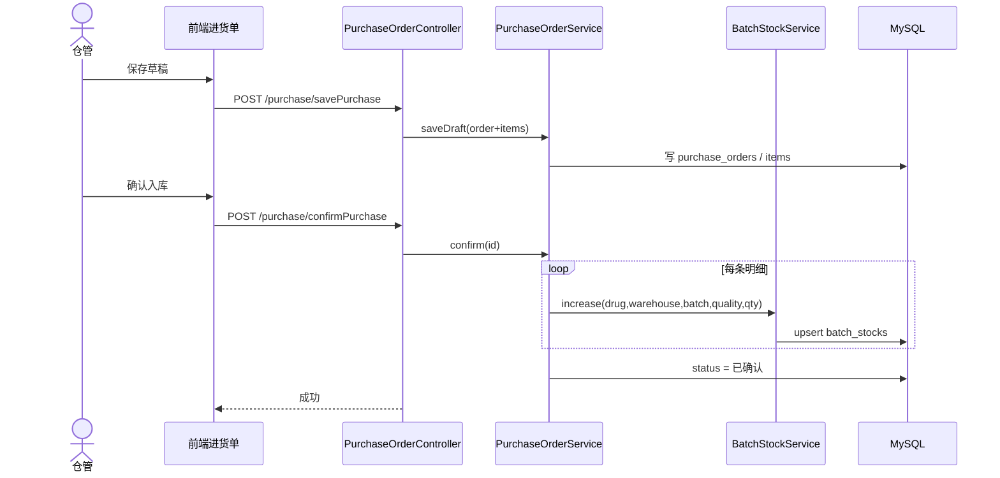
```mermaid
sequenceDiagram
  actor User as 仓管
  participant UI as 前端进货单
  participant API as PurchaseOrderController
  participant Svc as PurchaseOrderService
  participant Stock as BatchStockService
  participant DB as MySQL

  User->>UI: 保存草稿
  UI->>API: POST /purchase/savePurchase
  API->>Svc: saveDraft(order+items)
  Svc->>DB: 写 purchase_orders / items

  User->>UI: 确认入库
  UI->>API: POST /purchase/confirmPurchase
  API->>Svc: confirm(id)
  loop 每条明细
    Svc->>Stock: increase(drug,warehouse,batch,quality,qty)
    Stock->>DB: upsert batch_stocks
  end
  Svc->>DB: status = 已确认
  API-->>UI: 成功
```

#### 3.5.2 出库确认 + 按发票采集追溯码

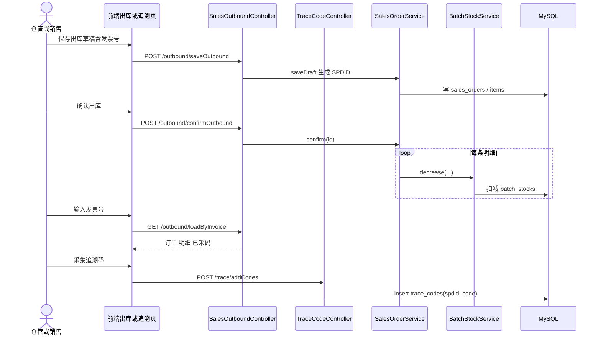
```mermaid
sequenceDiagram
  actor User as 仓管或销售
  participant UI as 前端出库或追溯页
  participant Out as SalesOutboundController
  participant Trace as TraceCodeController
  participant Svc as SalesOrderService
  participant Stock as BatchStockService
  participant DB as MySQL

  User->>UI: 保存出库草稿含发票号
  UI->>Out: POST /outbound/saveOutbound
  Out->>Svc: saveDraft 生成 SPDID
  Svc->>DB: 写 sales_orders / items

  User->>UI: 确认出库
  UI->>Out: POST /outbound/confirmOutbound
  Out->>Svc: confirm(id)
  loop 每条明细
    Svc->>Stock: decrease(...)
    Stock->>DB: 扣减 batch_stocks
  end

  User->>UI: 输入发票号
  UI->>Out: GET /outbound/loadByInvoice
  Out-->>UI: 订单 明细 已采码

  User->>UI: 采集追溯码
  UI->>Trace: POST /trace/addCodes
  Trace->>DB: insert trace_codes(spdid, code)
```

#### 3.5.3 红冲确认 → 库存加回

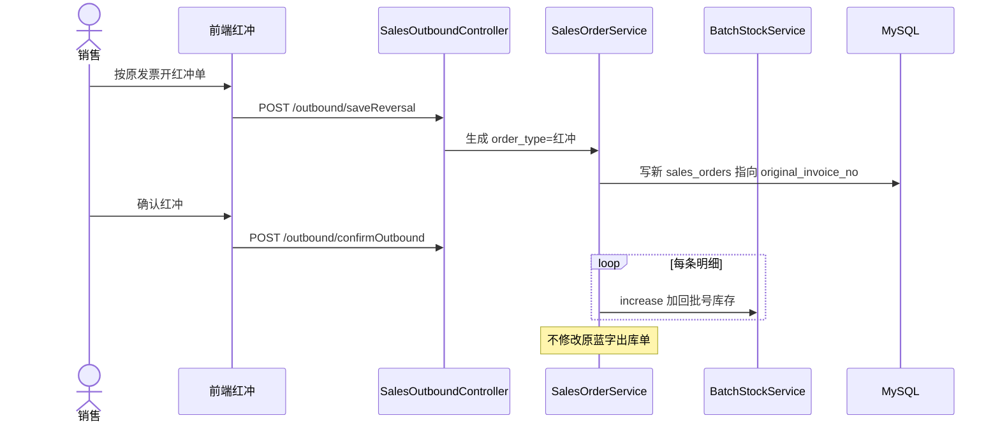
```mermaid
sequenceDiagram
  actor User as 销售
  participant UI as 前端红冲
  participant Out as SalesOutboundController
  participant Svc as SalesOrderService
  participant Stock as BatchStockService
  participant DB as MySQL

  User->>UI: 按原发票开红冲单
  UI->>Out: POST /outbound/saveReversal
  Out->>Svc: 生成 order_type=红冲
  Svc->>DB: 写新 sales_orders 指向 original_invoice_no

  User->>UI: 确认红冲
  UI->>Out: POST /outbound/confirmOutbound
  loop 每条明细
    Svc->>Stock: increase 加回批号库存
  end
  Note over Svc: 不修改原蓝字出库单
```

#### 3.5.4 包装解析（大码 → 中码 / 小码）

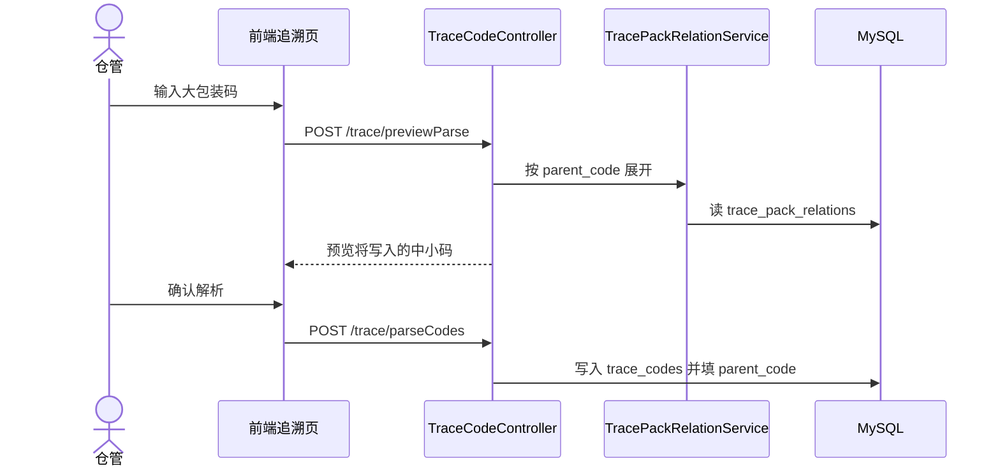
```mermaid
sequenceDiagram
  actor User as 仓管
  participant UI as 前端追溯页
  participant Trace as TraceCodeController
  participant Rel as TracePackRelationService
  participant DB as MySQL

  User->>UI: 输入大包装码
  UI->>Trace: POST /trace/previewParse
  Trace->>Rel: 按 parent_code 展开
  Rel->>DB: 读 trace_pack_relations
  Trace-->>UI: 预览将写入的中小码

  User->>UI: 确认解析
  UI->>Trace: POST /trace/parseCodes
  Trace->>DB: 写入 trace_codes 并填 parent_code
```

#### 3.5.5 升益确认 / 医院收货（短流程）

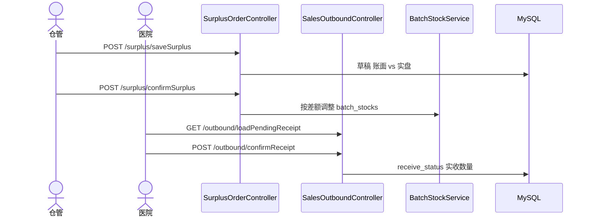
```mermaid
sequenceDiagram
  actor K as 仓管
  actor H as 医院
  participant Sur as SurplusOrderController
  participant Out as SalesOutboundController
  participant Stock as BatchStockService
  participant DB as MySQL

  K->>Sur: POST /surplus/saveSurplus
  Sur->>DB: 草稿 账面 vs 实盘
  K->>Sur: POST /surplus/confirmSurplus
  Sur->>Stock: 按差额调整 batch_stocks

  H->>Out: GET /outbound/loadPendingReceipt
  H->>Out: POST /outbound/confirmReceipt
  Out->>DB: receive_status 实收数量
```

### 3.6 状态图

#### 3.6.1 进货 / 出库 / 升益单据

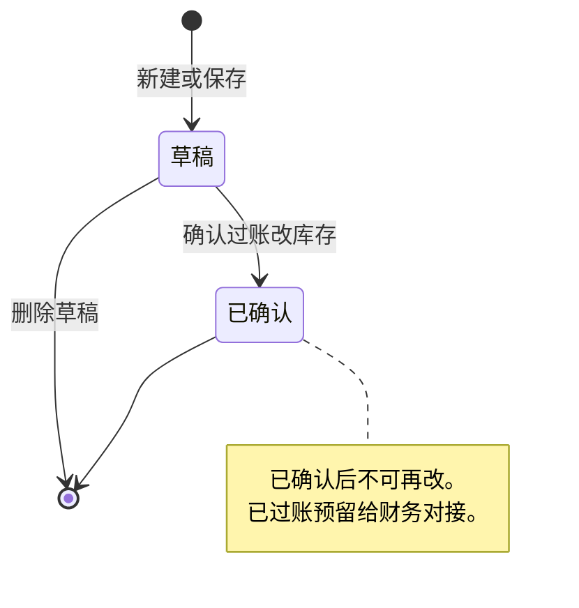
```mermaid
stateDiagram-v2
  [*] --> 草稿 : 新建或保存
  草稿 --> 已确认 : 确认过账改库存
  草稿 --> [*] : 删除草稿
  已确认 --> [*]
  note right of 已确认
    已确认后不可再改。
    已过账预留给财务对接。
  end note
```

出库确认时额外：写入 `ship_time`，`einvoice_no` 默认同发票号；非红冲单进入收货状态机。

#### 3.6.2 回款

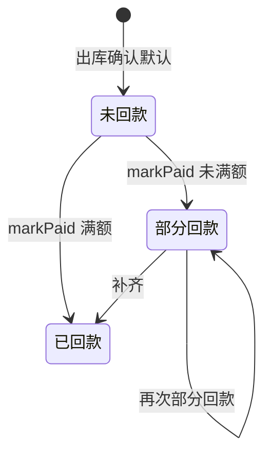
```mermaid
stateDiagram-v2
  [*] --> 未回款 : 出库确认默认
  未回款 --> 部分回款 : markPaid 未满额
  未回款 --> 已回款 : markPaid 满额
  部分回款 --> 已回款 : 补齐
  部分回款 --> 部分回款 : 再次部分回款
```

#### 3.6.3 医院收货

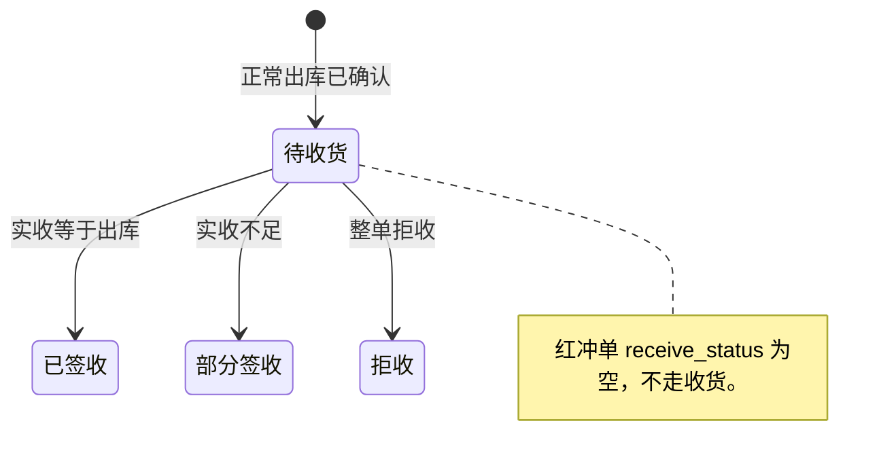
```mermaid
stateDiagram-v2
  [*] --> 待收货 : 正常出库已确认
  待收货 --> 已签收 : 实收等于出库
  待收货 --> 部分签收 : 实收不足
  待收货 --> 拒收 : 整单拒收
  note right of 待收货
    红冲单 receive_status 为空，不走收货。
  end note
```

#### 3.6.4 追溯码

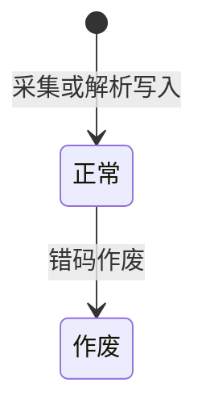
```mermaid
stateDiagram-v2
  [*] --> 正常 : 采集或解析写入
  正常 --> 作废 : 错码作废
```

---

## 4. 表清单

| 中文名 | MySQL 表 | 层级 | Java 实体 |
|---|---|---|---|
| 岗位 | `positions` | 档案 | （无独立 Entity） |
| 员工 | `employees` | 档案 | （无独立 Entity） |
| 供应商 | `suppliers` | 档案 | `Supplier` |
| 客户 | `customers` | 档案 | `Customer` |
| 药品 | `drugs` | 档案 | `Drug` |
| 仓库 | `warehouses` | 档案 | `Warehouse` |
| 进货单 | `purchase_orders` | 单据 | `PurchaseOrder` |
| 进货单明细 | `purchase_order_items` | 单据 | `PurchaseOrderItem` |
| 出库单 | `sales_orders` | 单据 | `SalesOrder` |
| 出库单明细 | `sales_order_items` | 单据 | `SalesOrderItem` |
| 批号库存 | `batch_stocks` | 库存 | `BatchStock` |
| 升益单 | `surplus_orders` | 库存 | `SurplusOrder` |
| 升益单明细 | `surplus_order_items` | 库存 | `SurplusOrderItem` |
| 追溯码 | `trace_codes` | 追溯 | `TraceCode` |
| 包装关联 | `trace_pack_relations` | 追溯 | `TracePackRelation` |
| 日清记录 | `daily_close_records` | 结账 | `DailyCloseRecord` |
| 月结记录 | `monthly_close_records` | 结账 | `MonthlyCloseRecord` |

另：`sys_user` / `sys_role` / `sys_permission` / `sys_role_permission` 管登录与菜单，与上表同库、模型独立。

建表 / 增量脚本在 `warehouse-back/src/main/resources/sql/`：

| 脚本 | 作用 |
|---|---|
| `pharma-demo-data.sql` | 档案与进销存演示数据、升益表 |
| `pharma-payment.sql` | 出库回款列 |
| `pharma-reversal.sql` | 红冲列 |
| `pharma-receipt.sql` | 发货 / 电子发票 / 签收列 |
| `pharma-trace-parse.sql` | `parent_code`、包装关联表 |
| `pharma-surplus.sql` | 升益表（与 demo 重复可重入） |
| `pharma-daily-close.sql` | 日清菜单 |
| `pharma-close-stats.sql` | 日清 / 月结表与统计菜单 |
| `pharma-purchase-confirm.sql` | 确认入库权限拆分 |

---

## 附录 A · 数据库选型

**继续用 MySQL 作主库。** 不要为了“看起来更企业”现在转 SQL Server。

只有这些情况才值得转 / 并行：老师明确要求；实习单位正式环境是 SQL Server；机房 Access 只能走 SQL Server ODBC。

| 维度 | MySQL（当前） | SQL Server |
|---|---|---|
| 与 Spring Boot | 已接通 `pharma_ims` | 要改驱动、方言、部署 |
| Mac 本机 | 顺畅 | 常靠 Docker / 远程 |
| 迁移 | — | 表结构可迁，应用层要回归 |

答辩口径：业务模型按药企进销存设计；当前 B/S 与开发环境统一 MySQL；若部署要求 SQL Server，表结构按本文 ER 迁移，应用层换数据源，不推翻领域模型。

---

## 附录 B · 画图工具

1. VS Code / Typora：直接渲染本文 Mermaid  
2. [mermaid.live](https://mermaid.live)：导出 PNG / SVG 贴 Word / PPT  
3. ProcessOn / draw.io：若老师要传统 crow’s foot，按第 2 节各层重画，不要把 2.0 和分层详图叠成一张  
4. Access 关系图：中文表名版可与本文对照，仍不要混入 `bus_*`

---

## 修订记录

| 日期 | 说明 |
|---|---|
| 2026-09-03 | 初版：对齐当时 `pharma_ims` 核心 12 表 |
| 2026-09-08 | ER 实体名、字段名改中文展示 |
| 2026-09-14 | 按现网补升益、包装关联、日清月结、红冲/回款/收货；ER/UML 分层，避免一张大图 |
