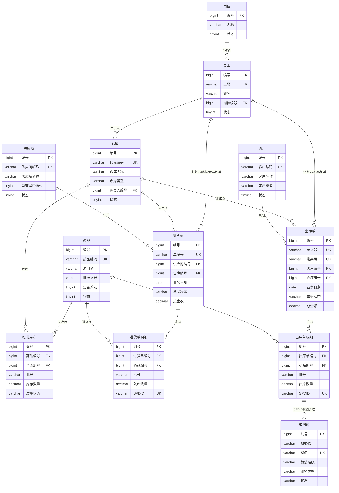
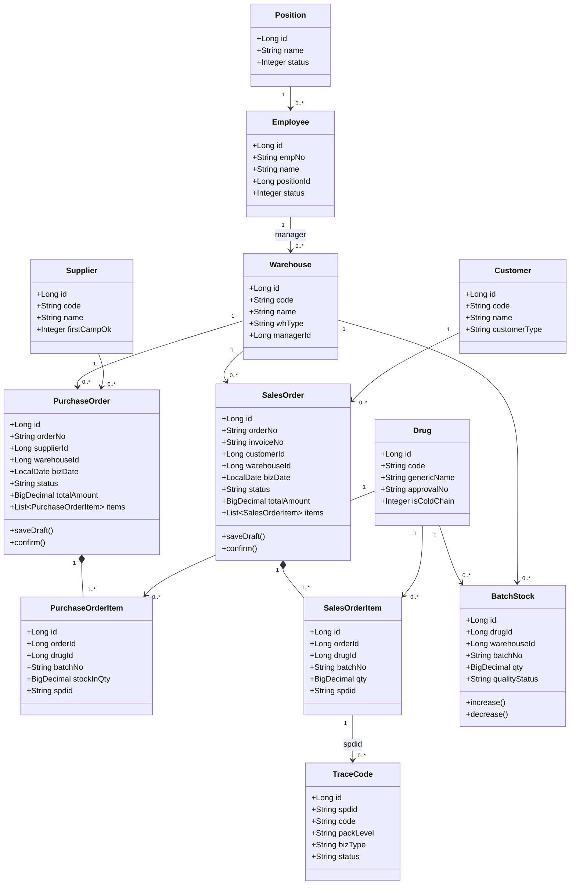
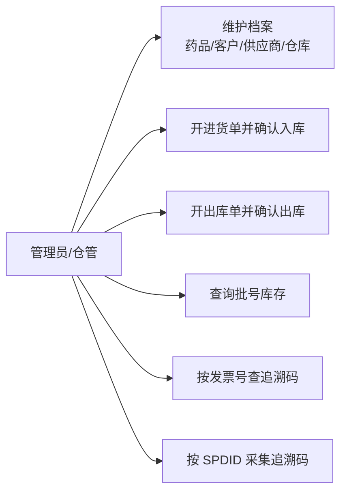
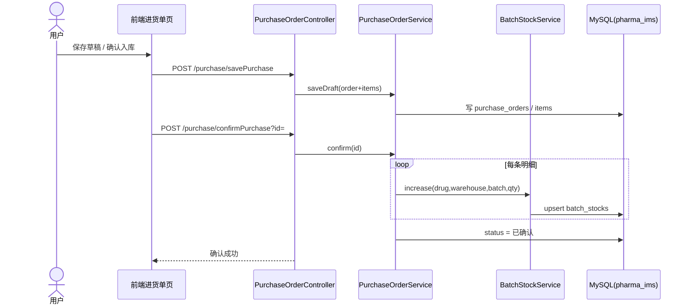
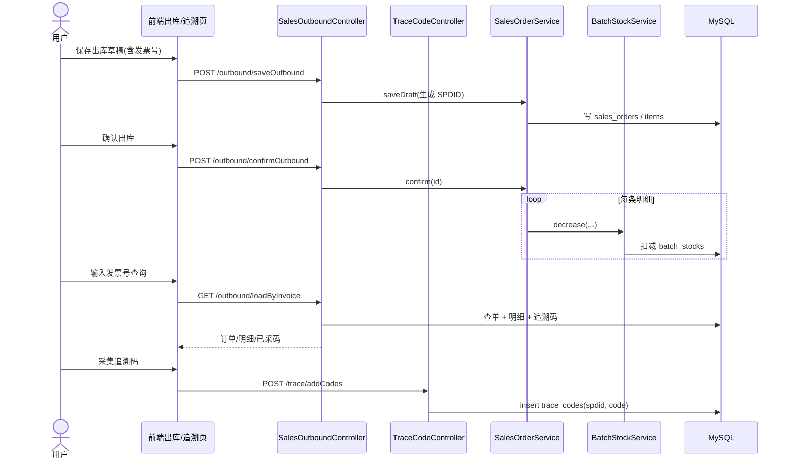
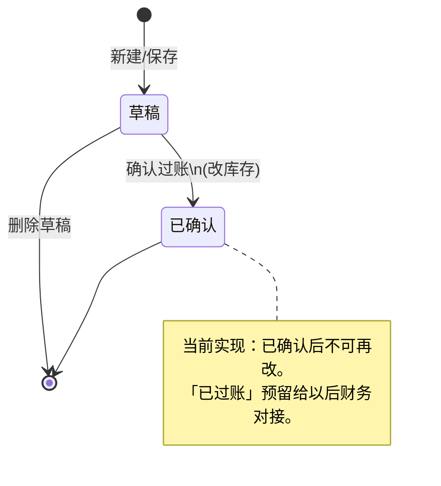

# 药企进销存：ER 图、UML 与数据库选型

> 依据当前库 `pharma_ims`（B/S 已接入）整理。  
> 登录权限仍使用 `sys_*` 表；本文业务模型只覆盖药企进销存核心表。

---

## 1. 业务总览

```text
档案层
  岗位 / 员工 / 供应商 / 客户 / 药品 / 仓库

单据层
  进货单 + 进货明细  → 确认后增加批号库存
  出库单 + 出库明细  → 确认后扣减批号库存
                       （主表含发票号，明细含 SPDID）

库存与追溯
  批号库存（药品 + 仓库 + 批号 + 质量状态）
  追溯码（按明细 SPDID 挂多条码）
```

核心查询链：

```text
发票号(sales_orders.invoice_no)
  → 出库明细(sales_order_items.spdid)
  → 追溯码(trace_codes.code)
```

---

## 2. ER 图（概念 / 逻辑）

可直接粘贴到支持 Mermaid 的 Markdown / Typora / GitHub / VS Code 预览。  
下图实体名、字段名为中文（便于课设展示）；物理表名仍见第 4 节。



### 2.1 关系说明（课设可直接写进文档）

| 关系 | 基数 | 说明 |
|---|---|---|
| 岗位 → 员工 | 1:N | 一个岗位多名员工 |
| 供应商 → 进货单 | 1:N | 一张进货单对应一个供应商 |
| 客户 → 出库单 | 1:N | 一张出库单对应一个客户 |
| 进货单 → 进货明细 | 1:N | 主从表 |
| 出库单 → 出库明细 | 1:N | 主从表；明细含 SPDID |
| 药品/仓库 → 批号库存 | N:M（通过库存表） | 唯一键：`drug_id + warehouse_id + batch_no + quality_status` |
| 出库明细 → 追溯码 | 1:N（逻辑） | 通过 `spdid` 关联；库中未建物理外键，便于入库侧也可挂码 |

### 2.2 库存唯一性（重要）

`batch_stocks` 唯一约束：

```text
uk_batch_stocks (drug_id, warehouse_id, batch_no, quality_status)
```

含义：**一物一批一库一质量状态 = 一条库存**。

---

## 3. UML

### 3.1 类图（领域模型，对应后端实体）



### 3.2 用例图（课设演示范围）



### 3.3 时序图：进货确认 → 批号库存增加



### 3.4 时序图：出库确认 + 发票号查追溯码



### 3.5 状态图：单据状态



---

## 4. 表清单（与 Access / 课设文档对齐）

| 中文名 | MySQL 表 | 层级 |
|---|---|---|
| 岗位 | `positions` | 档案 |
| 员工 | `employees` | 档案 |
| 供应商 | `suppliers` | 档案 |
| 客户 | `customers` | 档案 |
| 药品 | `drugs` | 档案 |
| 仓库 | `warehouses` | 档案 |
| 进货单 | `purchase_orders` | 单据 |
| 进货单明细 | `purchase_order_items` | 单据 |
| 出库单 | `sales_orders` | 单据 |
| 出库单明细 | `sales_order_items` | 单据 |
| 批号库存 | `batch_stocks` | 库存 |
| 追溯码 | `trace_codes` | 追溯 |

另：B/S 登录菜单权限使用 `sys_user / sys_role / sys_permission ...`，与业务库同库但模型独立。

---

## 5. 后面转 SQL Server 还是继续 MySQL？

### 结论（针对你这个项目）

**继续用 MySQL 作为主库；不要为了“看起来更企业”而现在转 SQL Server。**

只有下面情况才值得转 / 并行 SQL Server：

1. 老师/课设评分**明确要求** SQL Server  
2. 实习单位正式环境就是 SQL Server，你要做**对接演示**  
3. Access 只能用学校机房的 SQL Server ODBC，而连不上 MySQL  

除此之外，**MySQL 更合适**。

### 对比（按你的真实约束）

| 维度 | MySQL（推荐） | SQL Server |
|---|---|---|
| 与当前 Spring Boot 项目 | 已接通 `pharma_ims`，零迁移成本 | 要改驱动、方言、部分 SQL、部署 |
| Mac 本机开发 | 顺畅 | 本机装/连更麻烦，常靠远程/Docker |
| Access ODBC | 可行（需装 MySQL ODBC） | 学校 Windows 环境往往更现成 |
| 课设 811/812 加分 | 够用；B/S + 追溯码更有辨识度 | 若老师强调“微软技术栈”才更有分 |
| 药企实习常见度 | 常见 | 也很常见（尤其老系统/集团） |
| 迁移难度 | — | 表结构可迁，应用层要回归测试 |

### 建议策略

```text
现在～交课设
  主库 = MySQL（你已经在跑）
  Access = 同结构原型 / 少量窗体演示（或 ODBC 链 MySQL）

以后如果老师/实习强制 SQL Server
  1) 先冻结表结构（本文 ER）
  2) 用同名字段迁到 SQL Server
  3) 只改 application.yml 数据源 + 少量 SQL 方言
  4) 业务代码尽量不动（MyBatis-Plus 迁移成本可控）
```

### 一句话答辩口径

> 业务模型按药企进销存设计，数据库选型以可落地为准：当前 B/S 与开发环境统一使用 MySQL；若部署环境要求 SQL Server，表结构可平滑迁移，应用层通过更换数据源适配，不推翻领域模型。

---

## 6. 画图工具建议（交作业用）

1. **Typora / VS Code Mermaid 预览**：直接渲染本文图  
2. **[mermaid.live](https://mermaid.live)**：导出 PNG/SVG 贴进 Word/PPT  
3. **ProcessOn / draw.io**：把 ER 实体手工重画一版（部分老师更认“传统 ER 符号”）  
4. Access：关系图窗口可再画一份中文表名版，和本文对照

---

## 7. 修订记录

| 日期 | 说明 |
|---|---|
| 2026-09-03 | 初版：对齐 `pharma_ims` 现网表结构与 B/S 已实现链路 |
| 2026-09-08 | ER 图实体名、字段名改为中文展示；物理表名仍用英文 |
